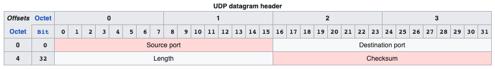

# IP Protocols

## IPv4
- Ref: https://en.wikipedia.org/wiki/Internet_Protocol_version_4
### Packet Structure

### Address Format

### Special address blocks
Address block | Address range | Number of addresses | Scope |	Description
--------------|---------------|---------------------|-------|--------------
**0.0.0.0/8** | 0.0.0.0–0.255.255.255 |16777216	| Software | Current (local, "this") network
**10.0.0.0/8** | 10.0.0.0–10.255.255.255 | 16777216	| Private network | Used for local communications within a private network
100.64.0.0/10 | 100.64.0.0–100.127.255.255 | 4194304 | Private network | Shared address space for communications between a service provider and its subscribers when using a carrier-grade NAT.
**127.0.0.0/8** | 127.0.0.0–127.255.255.255 | 16777216 | Host | Used for loopback addresses to the local host.
**169.254.0.0/16** | 169.254.0.0–169.254.255.255 | 65536 | Subnet | Used for link-local addresses between two hosts on a single link when no IP address is otherwise specified, such as would have normally been retrieved from a DHCP server.
**172.16.0.0/12** | 172.16.0.0–172.31.255.255 | 1048576 | Private network | Used for local communications within a private network.
192.0.0.0/24 | 192.0.0.0–192.0.0.255 | 256 | Private network | IETF Protocol Assignments, DS-Lite (/29).
192.0.2.0/24 | 192.0.2.0–192.0.2.255 | 256 | Documentation | Assigned as TEST-NET-1, documentation and examples.
192.88.99.0/24 | 192.88.99.0–192.88.99.255	| 256 | Internet | Reserved. Formerly used for IPv6 to IPv4 relay (included IPv6 address block 2002::/16).
**192.168.0.0/16** | 192.168.0.0–192.168.255.255 | 65536 | Private network	Used for local communications within a private network.
198.18.0.0/15 | 198.18.0.0–198.19.255.255 | 131072 | Private network | Used for benchmark testing of inter-network communications between two separate subnets.
198.51.100.0/24	| 198.51.100.0–198.51.100.255 | 256 | Documentation	Assigned as TEST-NET-2, documentation and examples.
203.0.113.0/24 | 203.0.113.0–203.0.113.255 | 256 | Documentation | Assigned as TEST-NET-3, documentation and examples.
**224.0.0.0/4**	| 224.0.0.0–239.255.255.255 | 268435456 | Internet | In use for IP multicast. (Former Class D network.)
233.252.0.0/24 | 233.252.0.0-233.252.0.255 | 256 | Documentation | Assigned as MCAST-TEST-NET, documentation and examples.
240.0.0.0/4	| 240.0.0.0–255.255.255.254	| 268435455	| Internet | Reserved for future use. (Former Class E network.)
255.255.255.255/32 | 255.255.255.255 | 1 | Subnet | Reserved for the "limited broadcast" destination address.

## IPv6
- Ref: https://en.wikipedia.org/wiki/IPv6_address

### Packet Structure

### Address Format

### Special Addresses

Special address blocks
Address block (CIDR) | First address | Last address | Number of addresses | Usage | Purpose
---------------------|---------------|--------------|---------------------|-------|--------
::/128 | :: | :: | 1 | Software | Unspecified address
::1/128 | ::1 | ::1	| 1 | Host | Loopback address—a virtual interface that loops all traffic back to itself, the local host
::ffff:0:0/96 | ::ffff:0.0.0.0 | ::ffff:255.255.255.255 | 2^128 − ^96 = 2^32 = 4294967296 | Software | IPv4-mapped addresses
::ffff:0:0:0/96 | ::ffff:0:0.0.0.0 | ::ffff:0:255.255.255.255 | 2^32 | Software | IPv4 translated addresses
64:ff9b::/96 | 64:ff9b::0.0.0.0 | 64:ff9b::255.255.255.255 | 2^32 | Global Internet |	IPv4/IPv6 translation.
64:ff9b:1::/48 | 64:ff9b:1:: | 64:ff9b:1:ffff:ffff:ffff:ffff:ffff | 2^80, with 2^48 for each IPv4 | Private internets | IPv4/IPv6 translation
100::/64 | 100:: | 100::ffff:ffff:ffff:ffff	| 2^64 | Routing | Discard prefix
2001:0000::/32 | 2001::	| 2001::ffff:ffff:ffff:ffff:ffff:ffff | 2^96 | Global Internet | Teredo tunneling
2001:20::/28 | 2001:20:: | 2001:2f:ffff:ffff:ffff:ffff:ffff:ffff | 2^100 | Software | ORCHIDv2
2001:db8::/32 | 2001:db8:: | 2001:db8:ffff:ffff:ffff:ffff:ffff:ffff | 2^96 | Documentation | Addresses used in documentation and example source code
2002::/16 | 2002:: | 2002:ffff:ffff:ffff:ffff:ffff:ffff:ffff | 2^112 | Global Internet | The 6to4 addressing scheme (deprecated)
fc00::/7 | fc00:: | fdff:ffff:ffff:ffff:ffff:ffff:ffff:ffff | 2^121 | Private internets |Unique local address
fe80::/64 from fe80::/10 | fe80:: | fe80::ffff:ffff:ffff:ffff | 2^64 | Link | Link-local address
ff00::/8 | ff00:: | ffff:ffff:ffff:ffff:ffff:ffff:ffff:ffff | 2^120 | Global Internet | Multicast address

## TCP
- Ref: https://en.wikipedia.org/wiki/Transmission_Control_Protocol
### Header

### Flags

- CWR (1 bit): Congestion window reduced (CWR) flag is set by the sending host to indicate that it received a TCP segment with the ECE flag set and had responded in congestion control mechanism.[a]
- ECE (1 bit): ECN-Echo has a dual role, depending on the value of the SYN flag. It indicates:
    - If the SYN flag is set (1), the TCP peer is ECN capable.
    - If the SYN flag is unset (0), a packet with the Congestion Experienced flag set (ECN=11) in its IP header was received during normal transmission.[a] This serves as an indication of network congestion (or impending congestion) to the TCP sender.
- URG (1 bit): Indicates that the Urgent pointer field is significant
- ACK (1 bit): Indicates that the Acknowledgment field is significant. All packets after the initial SYN packet sent by the client should have this flag set.
- PSH (1 bit): Push function. Asks to push the buffered data to the receiving application.
- RST (1 bit): Reset the connection
- SYN (1 bit): Synchronize sequence numbers. Only the first packet sent from each end should have this flag set. Some other flags and fields change meaning based on this flag, and some are only valid when it is set, and others when it is clear.
- FIN (1 bit): Last packet from sender

### TCP Connection Establishment

1. **SYN**: The active open is performed by the client sending a SYN to the server. The client sets the segment's sequence number to a random value A.
2. **SYN-ACK**: In response, the server replies with a SYN-ACK. The acknowledgment number is set to one more than the received sequence number i.e. A+1, and the sequence number that the server chooses for the packet is another random number, B.
3. **ACK**: Finally, the client sends an ACK back to the server. The sequence number is set to the received acknowledgment value i.e. A+1, and the acknowledgment number is set to one more than the received sequence number i.e. B+1.

### TCP Connection Termination

## UDP
- Ref: https://en.wikipedia.org/wiki/User_Datagram_Protocol

### Header

- UDP uses a simple connectionless communication model with a minimum of protocol mechanisms. 
- UDP provides checksums for data integrity, and port numbers for addressing different functions at the source and destination of the datagram. 
- UDP has no handshaking dialogues and thus exposes the user's program to any unreliability of the underlying network; there is no guarantee of delivery, ordering, or duplicate protection.

## ICMP
