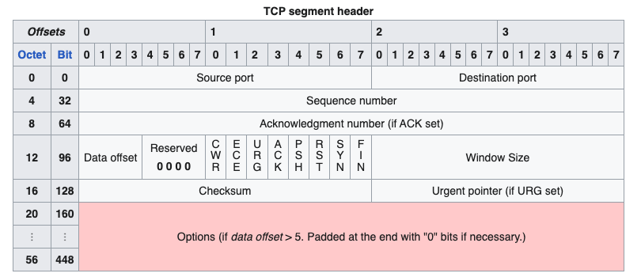

# IP Protocols

## IPv4
- Ref: https://en.wikipedia.org/wiki/Internet_Protocol_version_4
### Packet Structure

### Address Format

### Special address blocks
Address block | Address range | Number of addresses | Scope |	Description
--------------|---------------|---------------------|-------|--------------
**0.0.0.0/8** | 0.0.0.0–0.255.255.255 |16777216	| Software | Current (local, "this") network
**10.0.0.0/8** | 10.0.0.0–10.255.255.255 | 16777216	| Private network | Used for local communications within a private network
100.64.0.0/10 | 100.64.0.0–100.127.255.255 | 4194304 | Private network | Shared address space for communications between a service provider and its subscribers when using a carrier-grade NAT.
**127.0.0.0/8** | 127.0.0.0–127.255.255.255 | 16777216 | Host | Used for loopback addresses to the local host.
**169.254.0.0/16** | 169.254.0.0–169.254.255.255 | 65536 | Subnet | Used for link-local addresses between two hosts on a single link when no IP address is otherwise specified, such as would have normally been retrieved from a DHCP server.
**172.16.0.0/12** | 172.16.0.0–172.31.255.255 | 1048576 | Private network | Used for local communications within a private network.
192.0.0.0/24 | 192.0.0.0–192.0.0.255 | 256 | Private network | IETF Protocol Assignments, DS-Lite (/29).
192.0.2.0/24 | 192.0.2.0–192.0.2.255 | 256 | Documentation | Assigned as TEST-NET-1, documentation and examples.
192.88.99.0/24 | 192.88.99.0–192.88.99.255	| 256 | Internet | Reserved. Formerly used for IPv6 to IPv4 relay (included IPv6 address block 2002::/16).
**192.168.0.0/16** | 192.168.0.0–192.168.255.255 | 65536 | Private network	Used for local communications within a private network.
198.18.0.0/15 | 198.18.0.0–198.19.255.255 | 131072 | Private network | Used for benchmark testing of inter-network communications between two separate subnets.
198.51.100.0/24	| 198.51.100.0–198.51.100.255 | 256 | Documentation	Assigned as TEST-NET-2, documentation and examples.
203.0.113.0/24 | 203.0.113.0–203.0.113.255 | 256 | Documentation | Assigned as TEST-NET-3, documentation and examples.
**224.0.0.0/4**	| 224.0.0.0–239.255.255.255 | 268435456 | Internet | In use for IP multicast. (Former Class D network.)
233.252.0.0/24 | 233.252.0.0-233.252.0.255 | 256 | Documentation | Assigned as MCAST-TEST-NET, documentation and examples.
240.0.0.0/4	| 240.0.0.0–255.255.255.254	| 268435455	| Internet | Reserved for future use. (Former Class E network.)
255.255.255.255/32 | 255.255.255.255 | 1 | Subnet | Reserved for the "limited broadcast" destination address.

## IPv6
- Ref: https://en.wikipedia.org/wiki/IPv6_address

### Packet Structure

### Address Format

### Special Addresses

Special address blocks
Address block (CIDR) | First address | Last address | Number of addresses | Usage | Purpose
---------------------|---------------|--------------|---------------------|-------|--------
::/128 | :: | :: | 1 | Software | Unspecified address
::1/128 | ::1 | ::1	| 1 | Host | Loopback address—a virtual interface that loops all traffic back to itself, the local host
::ffff:0:0/96 | ::ffff:0.0.0.0 | ::ffff:255.255.255.255 | 2^128 − ^96 = 2^32 = 4294967296 | Software | IPv4-mapped addresses
::ffff:0:0:0/96 | ::ffff:0:0.0.0.0 | ::ffff:0:255.255.255.255 | 2^32 | Software | IPv4 translated addresses
64:ff9b::/96 | 64:ff9b::0.0.0.0 | 64:ff9b::255.255.255.255 | 2^32 | Global Internet |	IPv4/IPv6 translation.
64:ff9b:1::/48 | 64:ff9b:1:: | 64:ff9b:1:ffff:ffff:ffff:ffff:ffff | 2^80, with 2^48 for each IPv4 | Private internets | IPv4/IPv6 translation
100::/64 | 100:: | 100::ffff:ffff:ffff:ffff	| 2^64 | Routing | Discard prefix
2001:0000::/32 | 2001::	| 2001::ffff:ffff:ffff:ffff:ffff:ffff | 2^96 | Global Internet | Teredo tunneling
2001:20::/28 | 2001:20:: | 2001:2f:ffff:ffff:ffff:ffff:ffff:ffff | 2^100 | Software | ORCHIDv2
2001:db8::/32 | 2001:db8:: | 2001:db8:ffff:ffff:ffff:ffff:ffff:ffff | 2^96 | Documentation | Addresses used in documentation and example source code
2002::/16 | 2002:: | 2002:ffff:ffff:ffff:ffff:ffff:ffff:ffff | 2^112 | Global Internet | The 6to4 addressing scheme (deprecated)
fc00::/7 | fc00:: | fdff:ffff:ffff:ffff:ffff:ffff:ffff:ffff | 2^121 | Private internets |Unique local address
fe80::/64 from fe80::/10 | fe80:: | fe80::ffff:ffff:ffff:ffff | 2^64 | Link | Link-local address
ff00::/8 | ff00:: | ffff:ffff:ffff:ffff:ffff:ffff:ffff:ffff | 2^120 | Global Internet | Multicast address

## TCP
- Ref: https://en.wikipedia.org/wiki/Transmission_Control_Protocol
### Header

### Flags

- CWR (1 bit): Congestion window reduced (CWR) flag is set by the sending host to indicate that it received a TCP segment with the ECE flag set and had responded in congestion control mechanism.[a]
- ECE (1 bit): ECN-Echo has a dual role, depending on the value of the SYN flag. It indicates:
    - If the SYN flag is set (1), the TCP peer is ECN capable.
    - If the SYN flag is unset (0), a packet with the Congestion Experienced flag set (ECN=11) in its IP header was received during normal transmission.[a] This serves as an indication of network congestion (or impending congestion) to the TCP sender.
- URG (1 bit): Indicates that the Urgent pointer field is significant
- ACK (1 bit): Indicates that the Acknowledgment field is significant. All packets after the initial SYN packet sent by the client should have this flag set.
- PSH (1 bit): Push function. Asks to push the buffered data to the receiving application.
- RST (1 bit): Reset the connection
- SYN (1 bit): Synchronize sequence numbers. Only the first packet sent from each end should have this flag set. Some other flags and fields change meaning based on this flag, and some are only valid when it is set, and others when it is clear.
- FIN (1 bit): Last packet from sender

### TCP Connection Establishment

1. **SYN**: The active open is performed by the client sending a SYN to the server. The client sets the segment's sequence number to a random value A.
2. **SYN-ACK**: In response, the server replies with a SYN-ACK. The acknowledgment number is set to one more than the received sequence number i.e. A+1, and the sequence number that the server chooses for the packet is another random number, B.
3. **ACK**: Finally, the client sends an ACK back to the server. The sequence number is set to the received acknowledgment value i.e. A+1, and the acknowledgment number is set to one more than the received sequence number i.e. B+1.

### TCP Connection Termination

## UDP
- Ref: https://en.wikipedia.org/wiki/User_Datagram_Protocol

### Header

- UDP uses a simple connectionless communication model with a minimum of protocol mechanisms. 
- UDP provides checksums for data integrity, and port numbers for addressing different functions at the source and destination of the datagram. 
- UDP has no handshaking dialogues and thus exposes the user's program to any unreliability of the underlying network; there is no guarantee of delivery, ordering, or duplicate protection.

## ICMP

ICMP is a part of the Internet Protocol suite (RFC 792). It can be used in response to IP operational errors or control / diagnostic purposes, e.g. determine if a networked host is alive. The main network utilities to implement ICMP is: 
- Ping
- Traceroute

### Ping

The ping utility is implemented using ICMP control messages `Echo Request` and `Echo Reply`. The typical flow is as follows:
- **Echo Request:** An IP ICMP datagram is sent from the source host with:
    - ICMP Type `8` (*Echo Request*)
    - Time-To-Live (TTL)
    - Idenitfier (Unique for every ping on most Linux systems, but fixed on Windows systems)
    - Sequence Number (+1 from the identifier, incrementing with every request within that process)
- **Echo Reply:** An IP ICMP datagram is sent from the destination host with:
    - ICMP Type `0` (*Echo Reply*)
    - TTL
    - Sequence Number
    - Idenitifier (*Identifier and sequence number can be used to associate each echo request with its reply*)
    - Payload (*Containing the payload of the orginal request*)

#### Security Considerations
- **Denial of Service (DoS):** Systems that implement and process ICMP echo-requests are succeptible to `ping-flood` attacks, where an attacker sends a large number of ICMP `Echo Requests` in attempt to consume all the resources on a host.
- **Host Discovery:** An attacker can use a technique known as `ping sweeps` to discover available hosts on a netowrk. This can be done using `Echo Requests` or other ICMP control message types.

### Traceroute

The traceroute utility, similar to the Windows based `PathPing` command, tries to map the availability of hosts within the netwrk path, between a source host and its target destination. Traceroute's behaviour is different depending in its OS implementation:
- **Windows:**
    - Traceroute sends `ICMP Echo Request` (*Type 8*) messages
    - Determines a destination is reached by receiving an `ICMP Echo Reply` (*Type 0*) message
- ***nix:**
    - Traceroute sends `UDP` packets to destination port range **33434 - 33534** 
    - Determines a destination is reached by receiving an `ICMP Destination Unreachable` (*Type 3*) message

#### How Traceroute Works

Traceroute sends packets with TTLs that gradually increase in size *(+1)* after receiving a response from a hop in the network. Where the ping utility only receives an Echo Reply from the target destination, the traceroute utility works differently. *Traceroute obtains a response from each hop in the network path to the target destination.*

A typical flow is as follows: 
1. Source host sends ICMP Echo Request or UDP packet with a `TTL` value of `1` to the target destination.
2. The first hop in the path receives the packet and decrements the `TTL` value to `0`. As the TTL is now `0`, this hop in the path sends an `ICMP Time Exceeded` *(Type 11)* message back to the source host. This confirms the hop is alive and responded correctly to the TTL constraints of the IP protocol.
3. The source host sends another ICMP/UDP packet with an increased `TTL` value of `2` to the target destination.
4. This time the first hop receives the packet, decrements the `TTL` by `1`, making the `TTL` value `1` now. Since the TTL is 1, the hop forwards the ICMP/UDP packet on to the next hop in the path.
5. The next hop in the path receives the packet and decrements the `TTL` value by `1`, which now becomes `0`. As it is zero it sends the `ICMP Time Exceeded` *(Type 11)* message back to the source host.
6. The source continues to send ICMP/UDP packets with increasing `TTL` values until the destination sends an `Echo Reply` or `Destination Unreachable` ICMP message.

#### ICMP Control Messages

|Type|Code|Message|
|----|----|--------|
|**(0) Echo Reply**|**0**|**Echo Reply**|
|(1-2)||Reserved
|(3) Destination Unreachable|0|Destination network unreachable|
|**(3) Destination Unreachable**|**1**|**Destination host unreachable**|
|(3) Destination Unreachable|2|Destination protocol unreachable|
|(3) Destination Unreachable|3|Destination port unreachable|
|(3) Destination Unreachable|4|Fragmentation required, and DF flag set|
|(3) Destination Unreachable|5|Source route failed|
|(3) Destination Unreachable|6|Destination network unknown|
|(3) Destination Unreachable|7|Destination host unknown|
|(3) Destination Unreachable|8|Source host isolated|
|(3) Destination Unreachable|9|Network administratively prohibited|
|(3) Destination Unreachable|10|Host administratively prohibited|
|(3) Destination Unreachable|11|Network unreachable for ToS|
|(3) Destination Unreachable|12|Host unreachable for ToS|
|(3) Destination Unreachable|13|Communication administratively prohibited|
|(3) Destination Unreachable|14|Host Precedence Violation|
|(3) Destination Unreachable|15|Precedence cutoff in effect|
|(4) Source Quench|0|Source quench (congestion control) :exclamation: *deprecated*|
|(5) Redirect Message|0|Redirect Datagram for the Network|
|(5) Redirect Message|1|Redirect Datagram for the Host|
|(5) Redirect Message|2|Redirect Datagram for the ToS & Network|
|(5) Redirect Message|3|Redirect Datagram for the ToS & Host|
|(6) ||Alternate Host Address :exclamation: *deprecated*|
|(7) ||Reserved|
|**(8) Echo Request**|**0**|**Echo Reply**|
|(9) Router Advertisement|0|Router Advertisement|
|(10) Router Solicitation|0|Router discovery / selection / solicitation
|**(11) Time Exceeded**|**0**|**TTL expired in transit**|
|(11) Time Exceeded|1|Fragment reassembly time exceeded|
|(12) Parameter Problem: Bad IP Header|0|Pointer indicates the error|
|(12) Parameter Problem: Bad IP Header|1|Missing required option|
|(12) Parameter Problem: Bad IP Header|2|Bad length|
|**(13) Timestamp**|**0**|**Timestamp** *(used for time synchronization)*|
|(14) Timestamp Reply|0|Timestamp Reply|
|(15) Information Request|0|Information Request :exclamation: *deprecated*|
|(16) Information Reply|0|Information Reply :exclamation: *deprecated*|
|(17) Address Mask Request|0|Address Mask Request :exclamation: *deprecated*|
|(18) Address Mask Reply|0|Address Mask Reply :exclamation: *deprecated*|
|(30) Traceroute|0|Information Request :exclamation: *deprecated*|
|(42) Extended Echo Request|0|Request Extended Echo (XPing)|
|(43) Extended Echo Request|0|No Error|
|(43) Extended Echo Request|1|Malformed Query|
|(43) Extended Echo Request|2|No Such Interface|
|(43) Extended Echo Request|3|No Such Table Entry|
|(43) Extended Echo Request|4|Multiple Interfaces Satisfy Query|